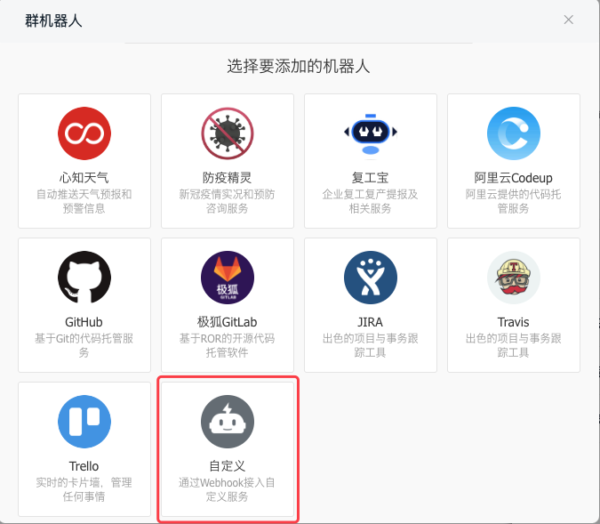
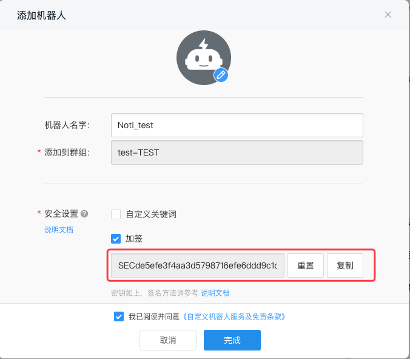
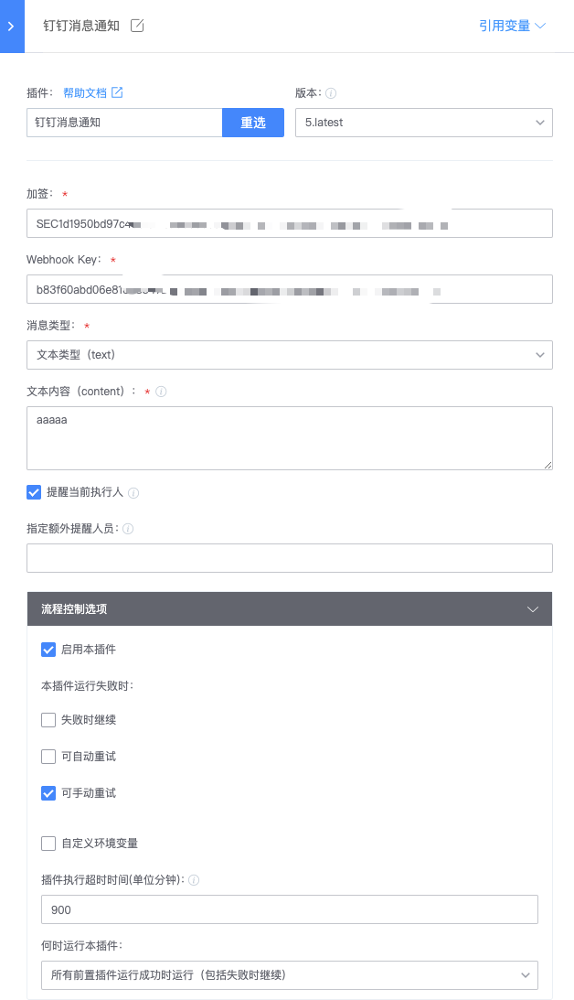
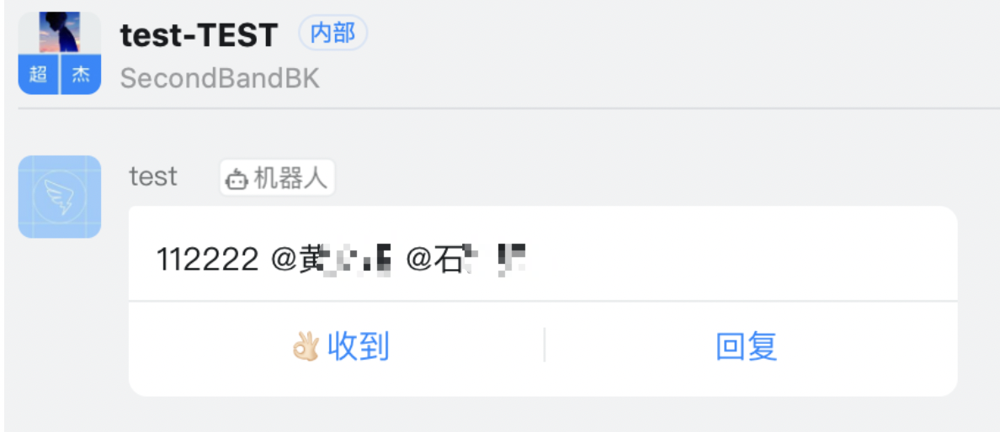

# 流水线通知发送到钉钉

## 关键词：发送通知、钉钉 

## 配置
插件上架时，需要配置蓝鲸智云相关参数，路径：设置->私有配置

* app_code:应用ID，别名bk_app_code，需要使用已添加至蓝鲸ESB接口调用白名单中的应用ID，建议使用蓝鲸开发者中心内的蓝盾调用ESB接口专用应用ID
* app_token: 应用ID对应的安全密钥(应用TOKEN)
* bk_paas_host: 蓝鲸paas地址, 例如： http://paas.service.consul:80

## 解决方案 

1、 在钉钉群管理页面，增加自定义机器人。

2、 推荐使用“加签”的安全设置，完成设置后记录机器人Webhook和加签信息。

3、 在蓝盾流水线编排中，增加“钉钉消息通知”插件，若没有请在蓝盾应用市场中添加。

4、 配置插件信息，如下所示：

5、流水线执行可在群里看到消息和

注：

1、消息类型支持普通文本消息和MD信息。

2、@流水线启动人（提醒当前执行人）的功能，暂时只适用LDAP账号体系有同步钉钉号的情况，其他账号体系暂未适配，可以按需求适配修改，建议先去掉这个按钮的勾选。
